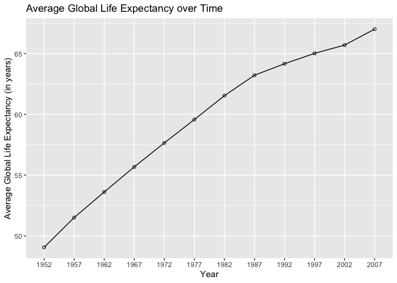
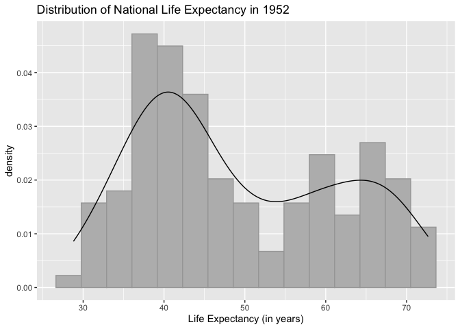
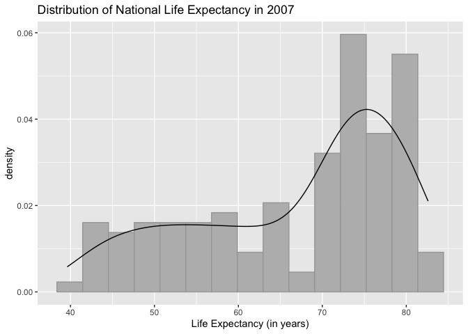
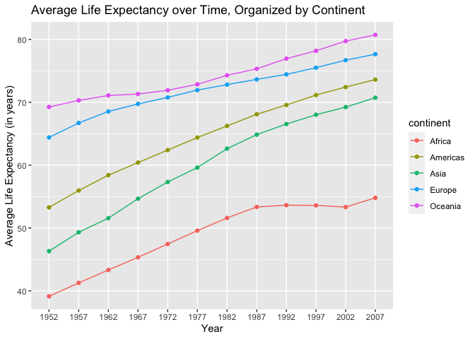
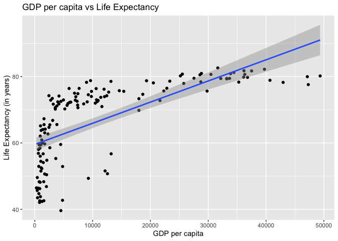
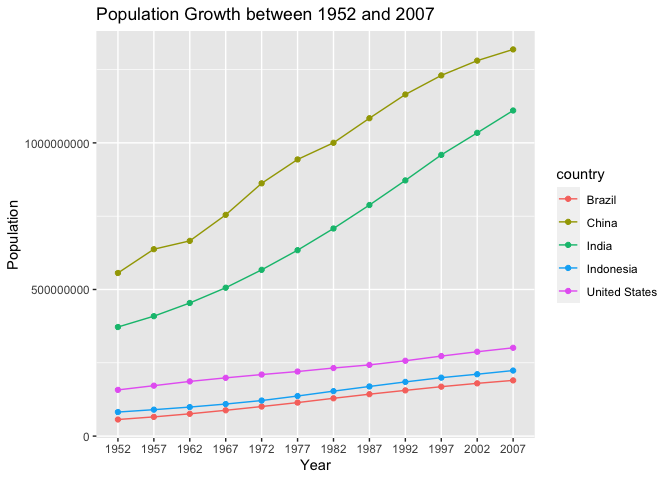
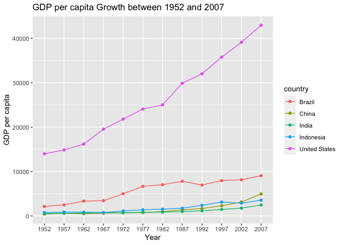
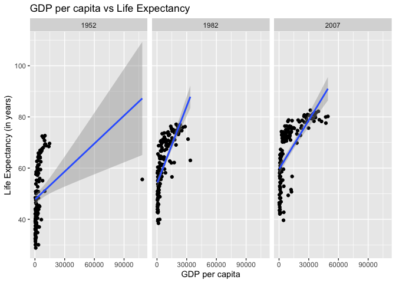

## Instructions
Answer the following questions and complete the exercises in RMarkdown. Please embed all of your code and push your final work to your repository. Your final lab report should be organized, clean, and run free from errors. Remember, you must remove the `#` for the included code chunks to run. Be sure to add your name to the author header above. For any included plots, make sure they are clearly labeled. You are free to use any plot type that you feel best communicates the results of your analysis.  

**In this homework, you should make use of the aesthetics you have learned. It's OK to be flashy!**

Make sure to use the formatting conventions of RMarkdown to make your report neat and clean!  

## Load the libraries

```r
library(tidyverse)
library(janitor)
library(here)
library(RColorBrewer)
library(paletteer)
library(naniar)
```


```r
options(scipen = 999)
```

## Resources
The idea for this assignment came from [Rebecca Barter's](http://www.rebeccabarter.com/blog/2017-11-17-ggplot2_tutorial/) ggplot tutorial so if you get stuck this is a good place to have a look.  

## Gapminder
For this assignment, we are going to use the dataset [gapminder](https://cran.r-project.org/web/packages/gapminder/index.html). Gapminder includes information about economics, population, and life expectancy from countries all over the world. You will need to install it before use. This is the same data that we will use for midterm 2 so this is good practice.

```r
#install.packages("gapminder")
library("gapminder")
```

## Questions
The questions below are open-ended and have many possible solutions. Your approach should, where appropriate, include numerical summaries and visuals. Be creative; assume you are building an analysis that you would ultimately present to an audience of stakeholders. Feel free to try out different `geoms` if they more clearly present your results.  

**1. Use the function(s) of your choice to get an idea of the overall structure of the data frame, including its dimensions, column names, variable classes, etc. As part of this, determine how NAs are treated in the data.**  


```r
#General overview of the data set:
gapminder <- gapminder %>% clean_names()
glimpse(gapminder)
```

```
## Rows: 1,704
## Columns: 6
## $ country    <fct> "Afghanistan", "Afghanistan", "Afghanistan", "Afghanistan",…
## $ continent  <fct> Asia, Asia, Asia, Asia, Asia, Asia, Asia, Asia, Asia, Asia,…
## $ year       <int> 1952, 1957, 1962, 1967, 1972, 1977, 1982, 1987, 1992, 1997,…
## $ life_exp   <dbl> 28.801, 30.332, 31.997, 34.020, 36.088, 38.438, 39.854, 40.…
## $ pop        <int> 8425333, 9240934, 10267083, 11537966, 13079460, 14880372, 1…
## $ gdp_percap <dbl> 779.4453, 820.8530, 853.1007, 836.1971, 739.9811, 786.1134,…
```

The gapminder data set contains 1,704 observations, for which 6 variables are measured (when possible). The variables include the following, with their data type contained within parentheses: country (factor), continent (factor), year (integer), life_exp (numeric), population (integer), and gdp_percap (numeric).


```r
#Checking how NAs have been handled:
summary(gapminder)
```

```
##         country        continent        year         life_exp    
##  Afghanistan:  12   Africa  :624   Min.   :1952   Min.   :23.60  
##  Albania    :  12   Americas:300   1st Qu.:1966   1st Qu.:48.20  
##  Algeria    :  12   Asia    :396   Median :1980   Median :60.71  
##  Angola     :  12   Europe  :360   Mean   :1980   Mean   :59.47  
##  Argentina  :  12   Oceania : 24   3rd Qu.:1993   3rd Qu.:70.85  
##  Australia  :  12                  Max.   :2007   Max.   :82.60  
##  (Other)    :1632                                                
##       pop               gdp_percap      
##  Min.   :     60011   Min.   :   241.2  
##  1st Qu.:   2793664   1st Qu.:  1202.1  
##  Median :   7023596   Median :  3531.8  
##  Mean   :  29601212   Mean   :  7215.3  
##  3rd Qu.:  19585222   3rd Qu.:  9325.5  
##  Max.   :1318683096   Max.   :113523.1  
## 
```

```r
miss_var_summary(gapminder)
```

```
## # A tibble: 6 × 3
##   variable   n_miss pct_miss
##   <chr>       <int>    <dbl>
## 1 country         0        0
## 2 continent       0        0
## 3 year            0        0
## 4 life_exp        0        0
## 5 pop             0        0
## 6 gdp_percap      0        0
```

The data doesn't appear to contain any NAs, based on the results of the "summary()" and "miss_var_summary()" functions. Upon further examination, although some of the values do appear quite low, they are not abnormally so (e.g. a negative life expectancy or GDP per capita).

**2. Among the interesting variables in gapminder is life expectancy. How has global life expectancy changed between 1952 and 2007?**


```r
gapminder %>%
  group_by(year) %>%
  summarize(mean_life_exp = mean(life_exp, na.rm = T), 
            min_life_exp = min(life_exp, na.rm = T), 
            max_life_exp = max(life_exp, na.rm = T)) %>%
  arrange(year)
```

```
## # A tibble: 12 × 4
##     year mean_life_exp min_life_exp max_life_exp
##    <int>         <dbl>        <dbl>        <dbl>
##  1  1952          49.1         28.8         72.7
##  2  1957          51.5         30.3         73.5
##  3  1962          53.6         32.0         73.7
##  4  1967          55.7         34.0         74.2
##  5  1972          57.6         35.4         74.7
##  6  1977          59.6         31.2         76.1
##  7  1982          61.5         38.4         77.1
##  8  1987          63.2         39.9         78.7
##  9  1992          64.2         23.6         79.4
## 10  1997          65.0         36.1         80.7
## 11  2002          65.7         39.2         82  
## 12  2007          67.0         39.6         82.6
```


```r
gapminder %>%
  mutate(year = as.factor(year)) %>%
  group_by(year) %>%
  summarize(mean_life_exp = mean(life_exp, na.rm = T), 
            min_life_exp = min(life_exp, na.rm = T), 
            max_life_exp = max(life_exp, na.rm = T)) %>%
  ggplot(aes(x=year, y=mean_life_exp))+
  geom_line(group=1)+
  geom_point(shape=1)+
  labs(title="Average Global Life Expectancy over Time",
       x="Year",
       y="Average Global Life Expectancy (in years)")
```

<!-- -->

With the exception of 1987 to 2002, the average global life expectancy has increased at a fairly constant, linear rate.

**3. How do the distributions of life expectancy compare for the years 1952 and 2007?**


```r
gapminder %>%
  filter(year==1952) %>%
  ggplot(aes(x=life_exp))+
  geom_histogram(aes(y = after_stat(density)), bins = 15, fill = "grey73", color ="grey65")+
  geom_density()+
  labs(title="Distribution of National Life Expectancy in 1952",
       x="Life Expectancy (in years)")
```

<!-- -->


```r
gapminder %>%
  filter(year==2007) %>%
  ggplot(aes(x=life_exp))+
  geom_histogram(aes(y = after_stat(density)), bins = 15,fill = "grey73", color ="grey65")+
  geom_density()+
  labs(title="Distribution of National Life Expectancy in 2007",
       x="Life Expectancy (in years)")
```

<!-- -->

The primary differences between each year's distribution relate to their shapes and symmetry. Specifically, the 1952 distrbution appears bimodal, with a larger peak around 40 years old, while the 2007 distribution is much more left-skewed, with a peak around 75 years old.

**4. Your answer above doesn't tell the whole story since life expectancy varies by region. Make a summary that shows the min, mean, and max life expectancy by continent for all years represented in the data.**


```r
gapminder %>%
  mutate(year = as.factor(year)) %>%
  group_by(continent, year) %>%
  summarize(mean_life_exp = mean(life_exp, na.rm = T), 
            min_life_exp = min(life_exp, na.rm = T), 
            max_life_exp = max(life_exp, na.rm = T), .groups = "keep")
```

```
## # A tibble: 60 × 5
## # Groups:   continent, year [60]
##    continent year  mean_life_exp min_life_exp max_life_exp
##    <fct>     <fct>         <dbl>        <dbl>        <dbl>
##  1 Africa    1952           39.1         30           52.7
##  2 Africa    1957           41.3         31.6         58.1
##  3 Africa    1962           43.3         32.8         60.2
##  4 Africa    1967           45.3         34.1         61.6
##  5 Africa    1972           47.5         35.4         64.3
##  6 Africa    1977           49.6         36.8         67.1
##  7 Africa    1982           51.6         38.4         69.9
##  8 Africa    1987           53.3         39.9         71.9
##  9 Africa    1992           53.6         23.6         73.6
## 10 Africa    1997           53.6         36.1         74.8
## # ℹ 50 more rows
```

**5. How has life expectancy changed between 1952-2007 for each continent?**


```r
gapminder %>%
  mutate(year = as.factor(year)) %>%
  group_by(continent, year) %>%
  summarize(mean_life_exp = mean(life_exp, na.rm = T), 
            min_life_exp = min(life_exp, na.rm = T), 
            max_life_exp = max(life_exp, na.rm = T), .groups = "keep") %>%
  ggplot(aes(x=year, y=mean_life_exp, group=continent, color=continent))+
  geom_line()+
  geom_point()+
  labs(title="Average Life Expectancy over Time, Organized by Continent",
       x="Year",
       y="Average Life Expectancy (in years)")
```

<!-- -->

**6. We are interested in the relationship between per capita GDP and life expectancy; i.e. does having more money help you live longer?**


```r
gapminder %>%
  filter(year==2007) %>% #I added this condition to remove the influence of the year the data was recorded.
  ggplot(mapping=aes(x=gdp_percap, y=life_exp))+
  geom_jitter()+
  geom_smooth(method=lm, se=T, na.rm = T)+
  labs(title="GDP per capita vs Life Expectancy",
       x="GDP per capita",
       y="Life Expectancy (in years)")
```

```
## `geom_smooth()` using formula = 'y ~ x'
```

<!-- -->

Yes, there does appear to be a correlation between the two variables; however, this correlation is very weak and does not appear to reflect a linear relationship.

**7. Which countries have had the largest population growth since 1952?**


```r
#Make the data set wide:
gapminder_wide <- gapminder %>%
  filter(year == 1952 | year == 2007) %>%
  select(-c(continent, life_exp, gdp_percap)) %>%
  pivot_wider(names_from = year,
              values_from = pop)

#Rename the columns to avoid any problems associated with their names being numeric:
colnames(gapminder_wide)[2] = "pop_1952"
colnames(gapminder_wide)[3] = "pop_2007"

#Add a column showing net population growth between 1952 and 2007:
gapminder_wide %>%
  mutate(net_pop_growth = pop_2007 - pop_1952) %>%
  arrange(desc(net_pop_growth))
```

```
## # A tibble: 142 × 4
##    country        pop_1952   pop_2007 net_pop_growth
##    <fct>             <int>      <int>          <int>
##  1 China         556263527 1318683096      762419569
##  2 India         372000000 1110396331      738396331
##  3 United States 157553000  301139947      143586947
##  4 Indonesia      82052000  223547000      141495000
##  5 Brazil         56602560  190010647      133408087
##  6 Pakistan       41346560  169270617      127924057
##  7 Bangladesh     46886859  150448339      103561480
##  8 Nigeria        33119096  135031164      101912068
##  9 Mexico         30144317  108700891       78556574
## 10 Philippines    22438691   91077287       68638596
## # ℹ 132 more rows
```

**8. Use your results from the question above to plot population growth for the top five countries since 1952.**


```r
gapminder %>%
  mutate(year = as.factor(year)) %>%
  filter(country %in% c("China", "India", "United States", "Indonesia", "Brazil")) %>%
  ggplot(aes(x=year, y=pop, group=country, color=country))+
  geom_line()+
  geom_point()+
  labs(title="Population Growth between 1952 and 2007",
       x="Year",
       y="Population")
```

<!-- -->

India and China appear to have experienced the largest net growth, as compared to the United States, Indonesia, and Brazil.

**9. How does per capita GDP growth compare between these same five countries?**


```r
gapminder %>%
  mutate(year = as.factor(year)) %>%
  filter(country %in% c("China", "India", "United States", "Indonesia", "Brazil")) %>%
  ggplot(aes(x=year, y=gdp_percap, group=country, color=country))+
  geom_line()+
  geom_point()+
  labs(title="GDP per capita Growth between 1952 and 2007",
       x="Year",
       y="GDP per capita")
```

<!-- -->

The United States stands out in its GDP per capita growth over this time interval.

**10. Make one plot of your choice that uses faceting!**


```r
gapminder %>%
  filter(year %in% c(1952, 1982, 2007)) %>%
  ggplot(mapping=aes(x=gdp_percap, y=life_exp))+
  geom_jitter()+
  geom_smooth(method=lm, se=T, na.rm = T)+
  labs(title="GDP per capita vs Life Expectancy",
       x="GDP per capita",
       y="Life Expectancy (in years)")+
  facet_wrap(~year)
```

```
## `geom_smooth()` using formula = 'y ~ x'
```

<!-- -->

This panel of plots shows the change in the relationship between GDP per capita and Life Expectancy over three timepoints which reflect the beginning, middle, and end of the data set. The changes in the correlation over time appear to suggest the linear model does not capture the relationship well.

## Push your final code to GitHub!
Please be sure that you check the `keep md` file in the knit preferences. 
